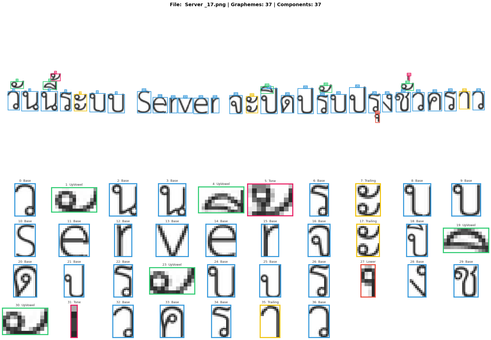

# TextRecognitionDataGenerator [](https://circleci.com/gh/Belval/TextRecognitionDataGenerator/tree/master) [](https://badge.fury.io/py/trdg) [](https://codecov.io/gh/Belval/TextRecognitionDataGenerator) [](https://textrecognitiondatagenerator.readthedocs.io/en/latest/?badge=latest)

A synthetic Thai data generator for text recognition

## What is it for?

Generating Thai text image samples to train an OCR software. Now supporting thai text! and export COCO format (BBOX CHARACTER LEVEL) For a more thorough tutorial see [the official documentation](https://textrecognitiondatagenerator.readthedocs.io/en/latest/index.html).

## What do I need to make it work?
```bash
pip install pillow nltk natsort six fire uharfbuzz fonttools opencv-python tqdm diffimg arabic-reshaper python-bidi wikipedia
```

### Basic (CLI)
```bash
python run.py -dt dicts/th_en_words.txt -oc -ft "fonts/th/THSarabun.ttf" -b 1 -k 0 -rk -d 0 -do 0 -bl 0 -stw 0 -f 64 -e png
```
```bash
python run.py -dt dicts/th_en_words.txt -oc -ft "fonts/th/THSarabun.ttf" -b 1 -k 0 -rk -d 0 -do 0 -bl 0 -stw 0 -d 3 -do 10 -f 64 -e png
```

### COCO Output Format

When using the `-oc` flag, the generator creates an `dataset/` folder with the following structure:

```text
dataset/
├── annotations/
│   ├── train.json
│   └── val.json
└── [images generated]
```

### Example


### Bounding Box Visualization



### Dictionary

The text is loaded from a dictionary file (that can be found in the *dicts* folder). By default, all lines from the dictionary are used. If the `-c` parameter is specified, the text is chosen at random from the dictionary. The text is drawn on a white background made with Gaussian noise (configurable). The resulting image is saved as [text]_[index].jpg
