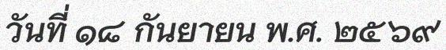
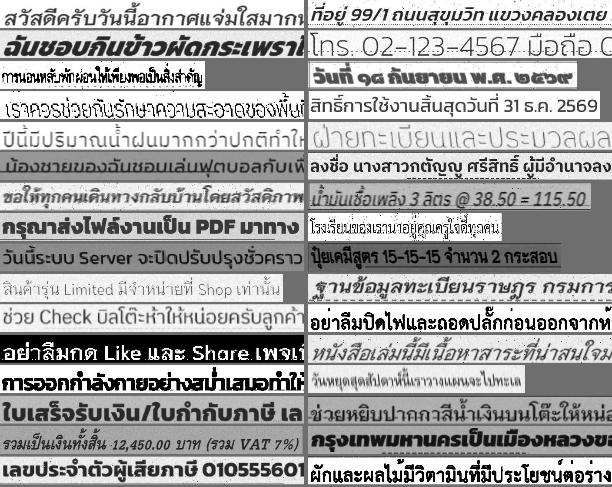
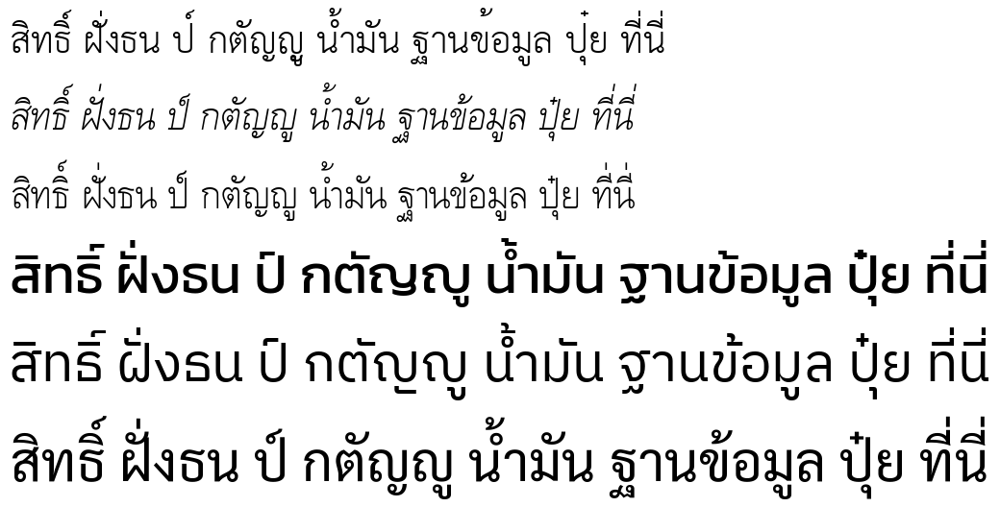

# ThaiTextRecognitionDataGenerator

Synthetic Thai / English line images for training an OCR **text recognizer** (CTC / SVTR /
PaddleOCR-style), with an optional COCO character-box mode for detectors.

Fork of [Belval/TextRecognitionDataGenerator](https://github.com/Belval/TextRecognitionDataGenerator)
with Thai shaping done properly through HarfBuzz (tone marks and vowels land where a real
font puts them), 312 bundled Thai fonts, a mixed-content corpus builder and document-style
augmentation that reproduces the failure modes of real scans and forms.

| | |
|---|---|
|  |  |

## Setup

Python 3.10+. Pure pip install, no OpenCV; wheels exist for Windows (x86-64 and ARM64), Linux and macOS.

```bash
python -m venv .venv && . .venv/bin/activate      # Windows: .venv\Scripts\activate
pip install -r requirements.txt
```

Docker: `docker build -t trdg . && docker run --rm -v $PWD/out:/app/out trdg trdg/run.py --help`

## 1. Build a corpus

Single dictionary words do not train a recognizer that has to read forms, invoices, chat
screenshots or books. `trdg.corpus` composes realistic lines: Thai runs (words joined the
way Thai is written, with occasional phrase spaces), English tokens, prices, dates in
Thai/Arabic numerals, phone and ID numbers, e-mails, addresses, form `label : value`
pairs, dotted leaders, list markers and common document phrases.

```bash
python -m trdg.corpus --count 200000 --out out/corpus.txt --charset_out out/charset.txt
```

Add natural text for better character statistics (Thai Wikipedia, your own documents,
one paragraph per line). `--natural_weight` controls the share (default 45%):

```bash
pip install pyarrow
python tools/fetch_thai_wiki.py                   # ~87 MB shard -> out/thai_wiki.txt
python -m trdg.corpus --count 500000 --text out/thai_wiki.txt my_docs.txt --out out/corpus.txt
```

Every line is NFC-normalised (`ํ`+`า` → `ำ`, zero-width chars removed), restricted to a
charset (default: Thai block + ASCII + a few symbols, or `--charset file`), kept within
`--min_len/--max_len` and cut only where a Thai grapheme cluster is not split.
Use `trdg.corpus.normalize` on OCR output before scoring, otherwise CER lies.

## 2. Render

```bash
python trdg/run.py -i out/corpus.txt -f 64 -e png -t 8 -aug doc --output_dir out
```

| flag | meaning |
|---|---|
| `-i` | corpus file, one line per image (streamed, any size) |
| `-f 64` | image height in px. Generate at ≥ 48; tone marks survive the trainer's resize better than when rendered at 32 |
| `-aug doc` | augmentation preset, see below (`off`, `doc`, `heavy`), `-ap 0.5` scales all probabilities |
| `-t 8` | worker processes |
| `-fd trdg/fonts/th_doc` | restrict fonts to the 45 document/UI fonts (default: all 312 in `fonts/th`) |
| `-k 3 -rk` | random skew ±3° |
| `-bl 1 -rbl` | random gaussian blur 0–1 px |
| `-b 0/1/2/3` | background: gaussian-noise paper, white, quasicrystal, image from `-id dir` |
| `-tc "#000000,#505050"` | text colour range |
| `--seed 1` | reproducible fonts and augmentation |
| `-c N` | stop after N lines (resume: existing files are skipped and kept in the labels) |

Output:

```
out/
├── base/0000/0.png …      5 000 images per bucket
├── labels.txt             base/0000/0.png<TAB>ประชุมทีม Backend วันศุกร์ 10:30
├── train.txt / val.txt    split by --train_ratio (default 0.95)
└── charset.txt            one character per line (space excluded)
```

Only images that were actually written are listed; lines a font cannot render (and no
bundled font covers) are skipped rather than drawn as tofu.

### Augmentation presets (`trdg/augment.py`)

Built from what breaks real Thai OCR: dotted form lines running through สระอุ/อู, thin
strokes dropping tone marks after downscaling, JPEG chat screenshots, faxed binarised prints.

| op | what it simulates | doc | heavy |
|---|---|---|---|
| underline | dotted / dashed / solid form line at or under the baseline | .35 | .50 |
| border | table-cell rules at the edges | .15 | .25 |
| morph | thicker (ink spread) or thinner (light print) strokes | .30 | .45 |
| lowres | downscale 35–75 % and back | .35 | .50 |
| motion | small motion blur | .05 | .15 |
| noise | gaussian / salt-and-pepper | .30 | .45 |
| contrast | brightness, contrast, gamma | .40 | .55 |
| jpeg | quality 20–75 | .40 | .50 |
| threshold | Otsu / adaptive binarisation | .05 | .10 |
| invert | light text on dark | .02 | .05 |
| shear, aspect | italic-ish shear, condensed/stretched width (geometric) | .10 / .15 | .30 |

Geometric ops change pixel positions, so they are disabled automatically when masks,
bounding boxes or COCO output are requested.



### Thai rendering notes

* Shaping is done by HarfBuzz; each glyph is then drawn at the shaped position, so
  stacked vowel + tone mark, left-shifted marks after ป ฝ ฟ and lowered marks are placed
  like the font intends. Every glyph is rasterized by glyph id (the font's cmap is remapped to
  U+F0000+gid for Pillow), so mark variants such as `uni0E4C.small` are drawn exactly as shaped
  and the image always matches the label; a line the font cannot draw (missing or blank
  glyph, dotted circle for an orphan mark) is skipped.
* Legacy fonts without GPOS (TH Sarabun PSK, the UPC family, Angsana/Cordia style fonts) get
  HarfBuzz's Thai fallback, which selects positional variants from the Private Use Area
  (U+F700–U+F71A). They are drawn by glyph id like every other glyph and mapped back to the
  standard character only for the character-box bookkeeping. Stacked marks, legacy and
  modern fonts alike (TH SarabunNew, UPC, Dillenia, Kanit, IBM Plex, Sarabun):

  
* Text a font cannot cover is rendered with another bundled font that can, per segment;
  if none can, the sample is skipped.

## 3. Shrink for shipping

`labels.txt` is already PaddleOCR's `SimpleDataSet` format, so the output folder can be handed
to a trainer as-is. PNG lines on noisy paper barely compress (~53 KB each, 200k = 10.8 GB);
grayscale JPEG at height 48 is 11.5 KB (2.3 GB) and most trainers resize to 48 anyway:

```bash
python tools/to_jpg.py out/rec out/jpg/rec --gray --height 48 -q 90 -t 8
tar -a -cf out/rec_200k_jpg.zip -C out/jpg rec     # Windows tar.exe / bsdtar
```

## COCO / character boxes (detector training)

The original character-level bounding-box pipeline is unchanged:

```bash
python trdg/run.py -i out/corpus.txt -oc -f 64 -e png --output_dir dataset/thai_text
```

writes `<id>_metadata.json` per image plus `coco-output/annotations/{train,val}.json`
with word polygons (category 1) and per-component character boxes (category 2: base,
leading/upper/lower/trailing vowel, tone, diacritic). Non-geometric augmentation may be
combined with it (`-aug doc`); shear/aspect are skipped automatically.

## Tests

```bash
python tests/test_rec_pipeline.py        # or: python -m pytest tests/
```

## Layout

```
trdg/corpus.py          corpus builder (python -m trdg.corpus)
trdg/augment.py         document-style augmentation
trdg/run.py             CLI: corpus -> images + labels
trdg/computer_text_generator.py   HarfBuzz shaping, per-glyph drawing, font fallback
trdg/vector_engine.py   glyph decomposition -> per-component boxes (COCO mode)
trdg/fonts/th           312 Thai fonts, trdg/fonts/th_doc 45 document/UI fonts
trdg/dicts/th.txt       81k Thai words, en.txt 466k English words
tools/fetch_thai_wiki.py  Thai Wikipedia -> plain text for --text
```

## Credits

[Belval/TextRecognitionDataGenerator](https://github.com/Belval/TextRecognitionDataGenerator) (MIT),
HarfBuzz via [uharfbuzz](https://github.com/harfbuzz/uharfbuzz), fonts under their own
licences (Google Fonts Thai collection, UPC fonts).
